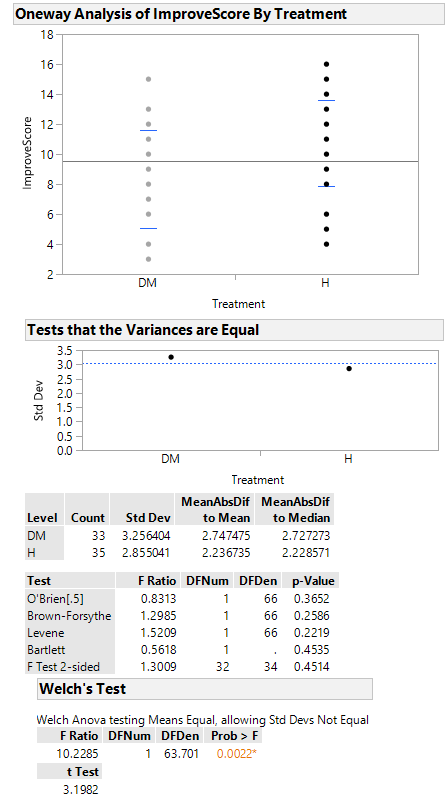

### Comparing Two Population Variances: Independent Sampling
In Archives of Pediatrics and Adolescent Medicine (Dec. 2007), a study of honey as a children’s cough remedy was conducted in which 68 children were randomly assigned to receive either a cold medicine (DM group, n=33) or honey (H group, n=35). Cough improvement scores were recorded for the two groups. Researchers wanted to know if the variability in coughing improvement scores differed between the two groups.

### Conditions Required for Valid Inferences about (σ^2(1) / σ^2(2)) 
1. The samples are random and independent.
2. Both populations are normally distributed.

From the informations given, our samples are independent since the children were randomly assigned to the two different groups. We will assume that the 68 children were randomly selected for this project.

Checking the normal quantile plots, we will assume the populations are about normally distributed. If we have doubts about the normality of the populations, we could always opt for a nonparametric method like Levene's Test. 


### Hypotheses for Equal Population Variances (σ^2(1) = σ^2(2)): F-Statistic

The common statistical procedure for comparing population variances (σ^2(1)) and (σ^2(2)) makes an inference about the ratio σ^2(1) / σ^2(2). To make this inference, we will use the ratio of the sample variances s^2(1) / s^2(2) as our test statistic.  
 
When the above assumptions are satisfied and the null hypothesis is true, our F test statistic's sampling distribution is the F-distribution with n1 - 1 numerator degree of freedom and n2 - 1 denominator degrees of freedom. The F-distribution is right skewed because the ratio of sample variances can not be less than zero. 

Let σ^2(1) = population variance of improvement scores for the DM group and σ^2(2) = population variance of improvement scores for the honey group.

Ho: σ^2(1) / σ^2(2) = 1

Ha: σ^2(1) / σ^2(2) != 1

The F-distribution critical values correspond to the upper tail areas of the distribution. Because we have a two-tailed F-test, we need to make sure that the upper tail is used for the rejection region. We do this by placing larger sample variance in the numerator of our F test statistic. 

F = 10.60 / 8.15 = 1.3 

In our example, the DM group has the largest sample variance which is why it is in the numerator for our F test statistic. This doubles the value for alpha since their is double the chance the F-ratio will be in the upper tail of the distribution. Essentially, we establish a one-tailed rejection region instead of a two-tail rejection region.

### Test of Hypotheses for Equal Population Variances (σ^2(1) = σ^2(2))
We have 32 numerator dfs and 34 denominator dfs in our example. Using a significance level of .10, F(a/2=.05) = 1.78304342
. Since 1.3 < 1.78304342, we do not reject the null hypothesis. Since F(0.23) = 1.29 wih a df of (32,34) is less than 1.3, we can assume the p-value is less than 2(0.23) = 0.46.

For a 90% confidence interval, we used the formula (1.3)(1/1.78304342) < σ^2(1) / σ^2(2) < (1.3)(1.79362045) = 0.7290904896 < σ^2(1) / σ^2(2) < 2.331706585. 

Running the test in JMP and R shows the same results.



```
library(tidyverse)

cough <- read.csv("cough.csv")
cough <- cough %>%
        select(ImproveScore,Treatment) %>%
        filter(Treatment == 'H' | Treatment == 'DM')

var.test(cough$ImproveScore~cough$Treatment,alternative = "two.sided",conf.level = .90)

# F test to compare two variances

# data:  cough$ImproveScore by cough$Treatment
# F = 1.3009, num df = 32, denom df = 34, p-value = 0.4514
# alternative hypothesis: true ratio of variances is not equal to 1
# 90 percent confidence interval:
# 0.7296084 2.3333631
# sample estimates:
# ratio of variances 
#          1.300924 
```
